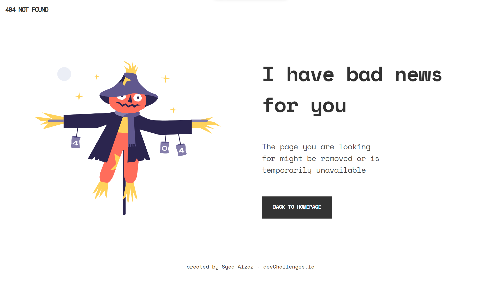

<!-- Please update value in the {}  -->

<h1 align="center">404 Not Found</h1>

   Solution for a challenge from  <a href="http://devchallenges.io" target="_blank">Devchallenges.io</a>.

  <h3>
    <a href="https://aizazc9.github.io/404-not-found-devChallenges-io/">
      Demo
    </a>
     | 
    <a href="https://github.com/AizazC9/404-not-found-devChallenges-io">
      Solution
    </a>
     | 
    <a href="https://devchallenges.io/challenges/wBunSb7FPrIepJZAg0sY">
      Challenge
    </a>
  </h3>

<!-- OVERVIEW -->

## Overview

## Contact

- GitHub [@Syed Aizaz](https://github.com/AizazC9)
